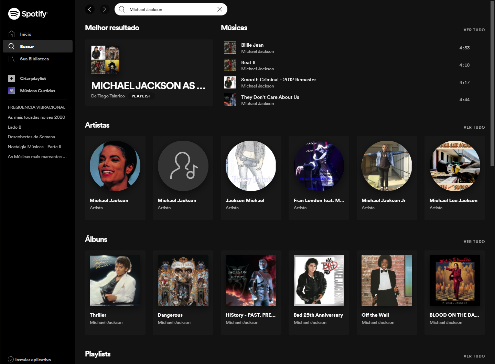
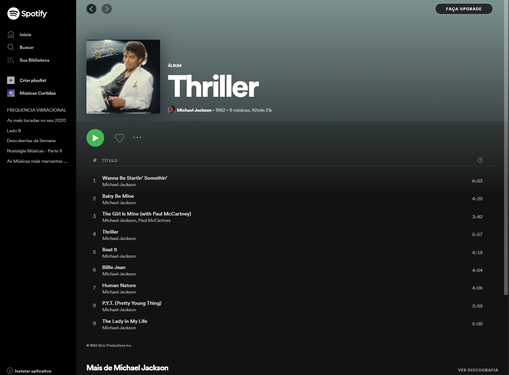

# Teste para desenvolvedor React

## Tecnologias

* React e Next.js
* TypeScript
* Material-UI
* Redux
* Docker

## Diferenciais

* Componentes reutilizáveis
* Testes automatizados
* Layout responsivo

## Descrição

Criar um webapp contendo algumas funcionalidades parecidas com o Spotify.

A página principal deverá listar resultados da pesquisa do usuário. Se o usuário digitar "Michael Jackson", deverá mostrar no topo as músicas mais ouvidas e abaixo os álbuns disponíveis.

O desenho desta tela deve seguir este design:

 

Quando o usuário clicar num álbum, deve-se mostrar as músicas deste álbum seguindo este design:

O usuário poderá alterar o tema do webapp entre três cores:

* Preto
* Amarelo
* Roxo

Ao selecionar um tema, todo o design da aplicação deve estar coerente entre as cores e contrastes de links, botões e textos.

## Detalhes técnicos

### Docker

* O ambiente da aplicação deverá usar Docker e Docker Compose para execução em desenvolvimento.

### Álbuns

* A lista de álbuns deverá estar num arquivo JSON e ser acessível através do `api route` do Next.js. Esta lista deve ser acessível através do endpoint `/api/albums`. Um álbum deve conter os seguintes dados:

    * id
    * nome
    * nome do artista
    * data de criação

* Cada álbum terá uma lista de músicas e ser acessível através da `api route` do Next.js. Esta lista deve ser acessível através do endpoint `/api/albums/:id`. Uma música deve conter os seguintes dados:

* id
* nome
* tamanho em minutos

### Tema

* Se não existir uma tema selecionado, o padrão deve ser preto.
* Quando o usuário escolher o tema deverá ser salvo no localstorage do browser.
* O controle de tema deverá usar o sistema de temas do Material-UI e Context API.

### Página de listagem de álbuns

* O controle da busca de álbuns deverá usar `Redux` em vez de `useState` ou `setState` ou `Context API`.
* A busca deverá ser dinâmica, ou seja, o usuário não precisa pressionar enter para ver os resultados.
* Cada busca feita deverá alterar a URL da aplicação usando uma query string, exemplo: `?search=Michael Jackson`. Ao recarregar completamente a página, já deverá ser montada com a busca feita.
* Além de realizar a busca com o Redux, a cada intervalo de 500 milissegundos da digitação do usuário, o Redux deve enviar a busca feita para o `api route` no endpoint `/api/search-log`. Deverá ser armazenado a busca feita num arquivo JSON com os dados: IP, Data/Hora, termo buscado.
* Deve listar apenas 10 álbuns por vez e ao rolar a barra de rolagem pra baixo ir carregando mais álbuns.
* A listagem de álbuns deverá ter um cache dinâmico de 20 segundos.
* Capriche no design usando todos os recursos disponíveis do Material-UI.

### Página de músicas do álbum

* Esta página não executará nenhuma música.
* Ao clicar em uma música deve-se "simular" que esta está sendo executada.
* A listagem de álbuns deverá ter um cache dinâmico de 40 segundos.
* Capriche no design usando todos os recursos disponíveis do Material-UI.

## Entrega

* Link do repositório Git remoto com o código-fonte do projeto.
* Endereço da aplicação hospedada na Vercel.